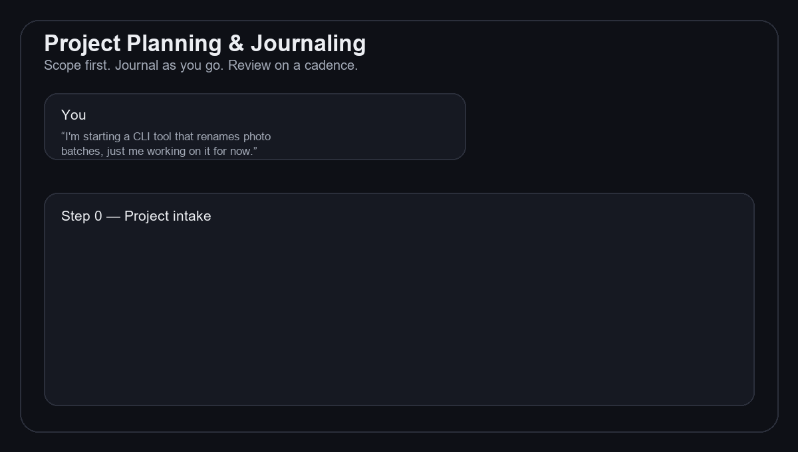

# Project Planning & Journaling — a Claude Skill

**English** · [Svenska](./README.sv.md) · [فارسی](./README.fa.md)

A skill for [Claude](https://claude.ai) that helps you scope a project properly before
writing any code, then keeps a living, resumable documentation journal of everything that
happens as the project moves forward.

Open a brand-new session weeks later, point Claude at `project-journal/README.md`, and it
knows exactly where things stand — no re-reading old chat history required.

Prefer a page over a chat? [`index.html`](./index.html) is a static overview with the same
install links — live at
[mh-mansouri.github.io/Project-Planning-Journaling](https://mh-mansouri.github.io/Project-Planning-Journaling/),
or just open the file locally, no server needed.

## What it does

- **Project intake** — before touching code, asks about project type, whether a Git repo
  already exists (and if not, proposes a name, visibility, and license), short vs.
  long-term goals, and whether this should stay public/open-source or could later become
  a private product.
- **Sets up a `project-journal/` folder** — separate from your source code, with a
  dashboard `README.md`, a `decisions/` log, real code `snippets/`, and optional
  per-session notes.
- **Writes a skimmable dashboard** — plain language, tables and Mermaid diagrams instead
  of prose, checklists for every milestone, collapsible sections for anything long.
- **Keeps itself up to date** — after any meaningful step, decision, commit, or push, it
  updates the roadmap, decisions log, git history, and next steps automatically.
- **Offers a development-style choice** — spec-first (plan fully up front),
  interactive/iterative (flexible, journal captures decisions after the fact), or a
  milestone-based hybrid.
- **Runs a routine review, not just event-triggered updates** — at whatever cadence you
  pick (weekly by default): every link still resolves, no decision's been silently
  overridden, no roadmap item has gone stale unnoticed, and any cited external sources
  are still reputable, not just still online.

## Install

**Option A — one click (easiest):**
Download [`project-planning-journaling.skill`](./project-planning-journaling.skill), open
it in Claude, and click **Save skill**. (Skill saving must be enabled for your account or
organization.)

**Option B — from the source folder:**
Copy the [`project-planning-journaling/`](./project-planning-journaling) folder into your
skills directory.

**Option C — any other AI chat (ChatGPT, Grok, Gemini, Copilot, DeepSeek, ...):**
Copy [`universal-prompt.md`](./universal-prompt.md) into your first message — no install,
no file upload, works anywhere.

## Use it

Just tell Claude you're starting (or resuming) a project, for example:

> I'm starting a new side project — a CLI tool for renaming photo batches. Let's plan it
> out before we write anything.

or, on an existing project:

> Set up a project journal for everything we've built so far, and keep it updated from
> now on.

or, to resume:

> Open the project journal and tell me where we left off.

## Good to know

The skill asks up front whether a project should stay public/open-source or might later
be forked into a private branch and developed as a standalone product — but the actual
decision (and any legal/licensing follow-up) is yours to make. The skill records it, it
doesn't make it for you.

## Grounded in established practice

The steps aren't invented from nothing — they draw on ten freely available sources
(architecture decision records, documentation frameworks, changelog and commit
conventions, discovery-phase methodology, Scrum) plus five commercially published
books/standards cited for their concepts only. Full list, evidence that each source is
independently reputable (not just a top search result), and which step each one backs,
in [`references/research.md`](./project-planning-journaling/references/research.md).
This repo follows its own Step 6: two weekly GitHub Actions keep the list honest — one
re-checks every link, the other opens a reminder issue for the reputation recheck.

## More skills like this

- **[Embedded / IoT Mentor](https://github.com/mh-mansouri/embedded-iot-mentor)** —
  picks the microcontroller, board, and toolchain for a hardware project, MVP-first.
- **[Business Name Fit](https://github.com/Elham-Farajnejad/business-name-fit)** —
  picks or checks a business/brand name that's authentic to your origin and lands well
  in the markets you're selling into.

## Contributing

Improvements are welcome — especially real-world cases where the journal format broke
down or the intake questions missed something. See [CONTRIBUTING.md](./CONTRIBUTING.md).
Release history is in [CHANGELOG.md](./CHANGELOG.md).

## License

Released under the [MIT License](./LICENSE) — free to use, share, and build on.

One bundled file is third-party: the 2020 Scrum Guide, redistributed under
[CC BY-SA 4.0](https://creativecommons.org/licenses/by-sa/4.0/) and not covered by the
MIT License. Full attribution is in [NOTICE.md](./NOTICE.md).
